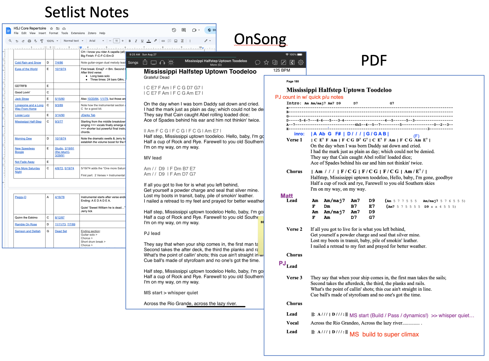

# ChordPro-SetLists

The goal of ChordPro-SetLists is to provide a simple way to produce setlist PDF files in multiple formats to satisfy the differing needs of band members during practice and performance.

## 1. Motivation

### How we did it before

In our band, setlist chart creation and management has been a complex and error-prone process: 

First, Philip created a Google Doc "Setlist notes page". This document contained the list of proposed songs, in order, along with notes (who sings, what key, notes about the structure of the tune), a link to a reference performance of the tune, and a link to a "vanilla" PDF version of the tune.  This document was made available to the band.

Second, Philip independently created a "personal" version of the song in chopro format, that he imported into the OnSong app for display during performance. Importantly, this version was lyrics-only, no chords, although it included performance notes such as who solos when. He did this because a lyrics-only version was much easier for him to use during performance as a singer.

Third, Kevin created a PDF file containing all the songs in the setlist. This file included chords as well as performance notes. This file typically went through a series of versions as new performance notes are added after rehearsals.

Here's a screen image showing these various sources of setlist info:



This approach had two primary problems:
1. The "Setlist Notes", "ChoPro", and "PDF" documents represented multiple, potentially inconsistent "sources of truth". They have been inconsistent on numerous occasions, leading to confusion during rehearsal.
2. Some information got "lost" altogether (for example, a listing of songs and key signature, which was originally present in Philip's Google Doc).

### How chordpro-setlists helps

ChordPro-SetLists is designed to address these problems. 

In ChordPro-SetLists, there is a songs/ directory that contains ChordPro versions for each song that can appear in any setlist.  

Each ChordPro song file contains lyrics, chords, key, tempo, performance notes, and a link to a reference version. It is a complete reference guide, the "single source of truth" for the song currently in rehearsal for performance.

To produce a setlist, you create a "setlist definition" files: a text file containing a list of song files, in order. 

Then you edit the make-setlist.sh file to refer to this file, and run it. 

Running the make-setlist.sh file creates (or overwrites) a directory and adds to it:
  * Two PDF versions of the setlist, one with and one without the chord information.
  * A subdirectory called "songs/" with two PDF versions for each song, one with and one without chord information, as well as the ChoPro file that was used to create it.

The following illustrates how a single ChordPro source file can be used to generate a view of the song with and without chords, as well as a summary page with key information.


Band members can select any combination of these PDF and ChoPro files to use during practice and performance. 

The benefits of this approach include:
* All of these views are consistent: while some views contain more (or less) information than others, there is no inconsistent information.  
* ChordPro-SetLists can generate custom PDFs to suit the needs of different band members.
* ChordPro-SetLists provides more information: the cover sheet lists the songs and keys in order, the PDF files contain links to the reference version, and the presentation is designed for readability onstage.
* ChordPro-SetLists yields an easy to navigate archive of prior setlists, documenting what we played, when we played, and how we played.
* Finally, implementing this approach using GitHub provides an opportunity for collaboration not present in the prior approach.

## 2. Installation

To install and run the system, you must install [ChordPro](https://www.chordpro.org/chordpro/chordpro-installation/).

Your installation is OK when you can invoke the chordpro command successfully:

```shell
% chordpro -V
This is ChordPro core 6.020 
```

## 3. Create a setlist

### 3.1 Create the setlist songlist file

The first step is creating a .txt file containing a list of songs. For example, the [tt-2023-08-19.txt](https://github.com/chordpro-setlists/setlists/blob/main/setlist-definitions/tt-2023-08-19.txt) songlist file looks like this:

```shell
songs/Bug.chopro
songs/BoogieOnReggaeWoman.chopro
songs/EverythingsRight.chopro
songs/Dirt.chopro
songs/LovingCup.chopro
```

By convention, the "songs/" directory contains a repository of the entire repertoire. The songlist file enables you to pick specific songs and the order in which they will be played for a particular performance.

### 3.2 Update make-setlist.sh

The next step is to edit make-setlist.sh to generate the PDF files for your new setlist. For example,  [make-setlist.sh](https://github.com/chordpro-setlists/setlists/blob/main/make-setlist.sh) currently looks like:

```html
#!/bin/bash

SETLIST="tt-2023-08-19"
VERSION=""
mkdir -p setlists/$SETLIST
mkdir -p setlists/$SETLIST/songs

## Create the setlists (with and without lyrics)
echo "Generating setlists..."
chordpro --config=config.json --config=$SETLIST.json -filelist $SETLIST.txt -o setlists/$SETLIST/setlist-$SETLIST-v${VERSION}.pdf

chordpro -l --config=config.json --config=$SETLIST.json -filelist $SETLIST.txt -o setlists/$SETLIST/setlist-$SETLIST-v${VERSION}.nochords.pdf

## Create individual songs (with and without lyrics)
echo "Generating individual songs..."
while IFS= read -r filename; do

  chordpro --meta=user=$SETLIST --config=config.json $filename -o setlists/$SETLIST/"${filename%.chopro}.pdf"

  chordpro --meta=user=$SETLIST -l --config=config.json $filename -o setlists/$SETLIST/"${filename%.chopro}.nochords.pdf"

done < "$SETLIST.txt"
```

In general, all you should need to do is edit the third line defining SETLIST.

### 3.3 Run make-setlist.sh

Now that everything is configured, you should be able to generate your new setlist by invoking `./make-setlist.sh`:

```sh
% ./make-setlist.sh
Generating setlist for tt-2023-08-19...
Generating individual songs...
  songs/Bug.chopro
  songs/BoogieOnReggaeWoman.chopro
  songs/EverythingsRight.chopro
  songs/Dirt.chopro
  songs/LovingCup.chopro
```

This will create (or overwrite) a subdirectory in the setlists/ directory that contains your new setlist. For example:

```
setlists/
         tt-2023-08-19/
                        setlist-tt-2023-08-19.pdf
                        setlist-tt-2023-08-19.nochords.pdf
                        songs/
                              Bug.pdf
                              :
```

### 3.4 Publish

Once the setlist looks the way you want it, you can commit your changes to GitHub. This will trigger a GitHub action that:

1. Installs ChordPro
2. Runs the `./make-setlist.sh` script (to generate the PDF files)
3. Runs the `./make-index.sh` script to generate an index.html file, 
4. Publishes the `setlists/` directory so that those files are accessable on the web.

Once the action completes, you can go to <https://chordpro-setlists.github.io/setlists/> to see your published setlist.
